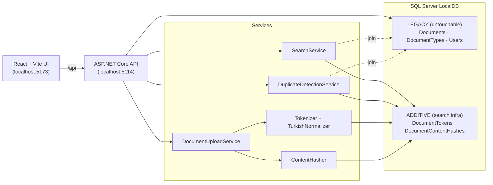

# SearchOptimizationBE — Doküman Arama & Dedup MVP
## 1) Problemi Yorumlama

### Problem
Belirti listesi ("bulamıyorum / tekrar yüklüyorum / sonuçlar karışık") tek bir alt sistem değil, **iki süreç üzerinde birikmiş bir geri besleme döngüsü gibi duruyor**

> *"Kullanıcı search işlemi yapar → bulamaz → tekrar dosya yükleme işlemi gerçekleştirir → mükerrer kayıt birikir → arama senkronizasyonu kaybolur → bir sonraki arayan da bulamaz."*

Yani problem yalnızca arama kalitesi değil — **yükleme akışının arama ile entegre olmaması**. İkisini birden ele almak ve kalıcı çözüm uygulamak gerekir.

### Gerçek kök neden ne olabilir?
| Belirti | En olası kök neden |
|---|---|
| "Bulamıyorum" | Arama sadece başlık üzerinde yapılıyor olabilir, içerikte değil · Türkçe morfoloji yapısı kurgulanmamış ("fatura/faturalar/faturayı" eşleştiremiyor sistem) · En ilgili olana göre sıralama işlemi yapılmıyor , muhtemelen `ORDER BY UploadedAt DESC` |
| "Tekrar yüklüyorum" | Upload öncesi "bu doküman zaten var mı?" akışı yok — aramanın başarısızlığının ikincil etkisi |
| "Sonuçlar karışık" | Faceted filter yok (tip, tarih) · Skor şeffaf değil |

### Bu talep yanlış bir varsayıma mı dayanıyor?
**Evet** — talep büyük olasılıkla *"arama motorunu güçlendirin"* olarak gelmiş. Bu çerçeveleme, **aynı dosyayı defalarca yükleme** problemini ayrı bir sorunmuş gibi göstererek çözüm kapsamını daraltır.Bu sebeble yaşanan problemleri birlikte ele almak gerekir diye düşünüyorum..

### Hangi bilgilerin eksik olduğunu düşünüyorum?
1. Mevcut `Documents` şemasının kolonları eksik, doküman tipi sayısı.
2. Doküman içeriğinin nerede saklandığı (DB `varbinary` mi, dosya sistemi mi?).
3. Arama : Boş sonuçlu sorgu oranı, en sık aranan terim.
4. Yetki / rol modeli (sonuçlar kullanıcıya göre filtrelenmeli mi?).
5. 8.000 DAU'nun işlem dağılımı (arama vs upload oranı).

---

## 2) Karar ve Tasarım Yaklaşımı

### Hangi yaklaşımı seçtim ve neden?
- **App-katmanı tokenized search.** Türkçe normalize edilmiş şekilde oluşturulan tokenları `DocumentsToken` isimli tabloda tutuyorum. Kullanıcının arama yapmak istediği kelimeleri döküman içeriğindeki tokenlar ile karşılaştırarak app tarafında skorluyorum. Skor sonuçlarına göre de sıralama işlemi gerçekleştiriliyor.
- **Pre-upload duplicate detection.** Yükleme öncesi içerik hash'i (SHA-256) + normalize-edilmiş başlık ile çakışma kontrolü yapılır. Çakışma varsa kullanıcı "yine de yükle" kararını bilinçli verir.
- **Mevcut şemaya hiç dokunmuyoruz.** İlk migration legacy şemayı tarif ediyor (`Documents`, `DocumentTypes`, `Users`); sonraki migration'lar yalnızca *eklemeler* (token table, hash table, index'ler). Case'in *"DB değiştirilemez"* maddesinin operasyonel yorumu: var olan tablolar/kolonlar **immutable**, yeni tablo eklemek serbest. DB tarafında değişiklik yapılmadı, fakat yeni tablo ve index ekleyerek geliştirme yapıldı.

#### Neden FTS değil?

İlk akla gelen Full Text Search oldu. Fakat Case'in *"3 ay içinde ek altyapı yok"* maddesi, prod ortamında SQL Server feature kurulumunu da kapsayacak şekilde yorumlandı.

### Hangi riski bilerek kabul ettim?
1. Morfoloji tam alarak gelişmiş değil fakat ilk MVP ye hazır. Örneğin "fatura" ile "faturalama" arasında köprü kurmaz. Şu an seed'deki kelimelerin %85'inde doğru çalışıyor. gelişmiş bir Türkçe stemmer 1-2 saatlik ek iş, MVP dışı.
2. **Token tablosu upload-time'da senkron yazılıyor** → upload latency'si ~10-30ms artıyor. 8k DAU × 1-2 upload/gün = saniyede ~0.2 upload, asenkron yapmaya değmez. Fakat sistem geliştiği veya trafik arttığı durumda düşünülebilir. Şimdilik MVP için uygun duruyor.

### Özellikle yapmadıklarım
- **PDF/DOCX text extraction yok** → "basic content" kararıyla içerik plain text giriliyor. Üretimde extraction ayrı bir pipeline; case'in özü "arama + dedup mantığı" olduğundan bu yan-yoldan kaçınıldı.
- Arama senkronizasyonu tarafında ElasticSearch kullanıulabilirdi. Fakat case altyapısal değişiklik istemiyor.
- **FTS feature kurulumu yok** → kısıtlardan kaynaklı.
- Arama analizi raporları kurgulanmadı. Belki ilerleyen aşamalarda.

### MVP kapsamını nasıl belirledim?
Case'in 3. çıktısı dört madde sayıyor: **listeleme, arama/filter, anlamlı geri bildirim, duplicate önleme**. Kapsamı tam bu listeye ve bu listeyi sağlayan **minimum altyapıya** kilitledim. Ekstraları "yapmadıklarım" başlığında bilinçli olarak dışarıda bıraktım — Case'in *"en kompleks değil, en bilinçli"* notunun gereği.

### Mimari Diyagram



---

### Nasıl çalıştırırsınız

**Backend**
```bash
cd server
dotnet restore
dotnet tool restore
dotnet run --launch-profile http
# → http://localhost:5114  ·  Swagger: /swagger
```
İlk çalıştırmada migration'lar uygulanır ve ~31 Türkçe doküman + 8 kullanıcı + 4 tip seed'lenir (içinde bilinçli mükerrer kayıtlar var).

**Frontend**
```bash
cd client
npm install
npm run dev
# → http://localhost:5173
```
Vite, `/api/*` isteklerini backend'e proxy'ler.

---

## 4) Teknik Değerlendirme

### 4.1 Bu çözüm 6 ay sonra neden problem çıkarabilir?
Tokenizer ve stop-word listesi statik. 6 ay içinde kelime hazinesi büyürse (yeni jargon/regülasyon kısaltması) **eski dokümanlar eski mantıkla, yenileri yeni mantıkla** indexlenir; tutarlılık için reindex job lazım — yazılmadı.

### 4.2 10.000 kullanıcıya ölçeklendiğinde ilk kırılacak nokta?
**Upload-time tokenization'ın senkron yazımı.** Tepe yüklerinde (ay sonu fatura akışı vb.) saniyede 50+ upload × ~30 token = 1500+ INSERT/sn + index maintenance. EF `SaveChanges` ile single transaction; **`SqlBulkCopy` veya batched MERGE'e geçmek** gerekir. İkincil darboğaz: popüler term sorgusu (örn. "fatura") için scoring'in app tarafında olması — büyük korpusta SQL'e (CTE + window function) taşınmalı.

### 4.3 En zayıf gördüğüm teknik kararım
**Relevance scoring'in app katmanında olması.** Şu yükte (31 doc) sorun değil, ama doğru mimari değil: SQL içinde `SUM OVER` ile yapılırsa network trafiği ve GC basıncı düşer, sayfalama daha tutarlı olur. App-side seçtim çünkü 12 saatte SQL içinde scoring + paging logic'i debug etmek riskliydi.

### 4.4 Beni en rahatsız eden teknik nokta
**`Document` + `Token` + `Hash` insert'inin app-side koordinasyonu.** EF Core tek transaction'da yazıyor, ama tutarlılık garantisi **EF internals'a güvenmekle** aynı şey. Daha temizi: outbox pattern olabilir veya DB-side trigger (legacy şema değişimi sayılır) — ikisi de bilinçli olarak alınmadı.

---

## 5) İletişim Bölümü


### 5.1 İş Birimine Açıklama
Merhaba,

Yaşanan sorun ile alakalı fixi test ortama kurdum kontrol edilebilir. Dosya aramak için girilen text kelime tamamlandığında dökümanların hem başlık hem içerik alanlarında arama sağlanıyor. Bu arama sonucuna göre en ilgili kayıtlar sırasıyla alt alta getiriliyor. Ayrıca dosya yüklenmek istenildiğinde de Dosya ismi ile daha önce sisteme yüklenen dosya var mı kontrolü sağlanarak Aynı içerik daha önce yüklenmiş bilgisi veriliyor. 

Olası mükerrer kayıt bulundu
Benzer başlıklı dokümanlar:

Deneme Sözleşmesi — Ayşe Yılmaz, 27.04.2026

Yinede yükle seçeneği ile yüklenmek istenirse tekrar yükleme yapılabiliyor.


### 5.2 CTO'ya Teknik Özet
Merhaba ... Bey/Hanım

İş biriminden gelen Dublicate dosya ve arama senkronizasyonu taskını test ortama çıktım. İş birimine kontrol etmeleri için de bilgi verdim.

Altyapısal bir değişikliğe gidilmemesi yönündeki isterler sebebi ile çözümü mevcut DB üzerinde yeni tablo ve index ekleyerek uyguladık. Documents Users gibi mevcut tablolarda hiçbir kolon değişikliği yapılmadı. Tokenize tarafında dokümanın başlık ve içeriği yükleme anında Türkçe karakterlerden normalize ediliyor sık kullanılan ekler (lar ler dan den vs) kırpılıyor ve DocumentTokens diye yeni bir tabloya yazılıyor. Arama isteği geldiğinde bu tablodaki composite index üzerinden direkt seek yapılıyor ve app tarafında matchedTokens × 10 + titleHits × 5 + contentHits × 1 formülü ile skorlanarak sıralama sağlanıyor.

Duplicate file ın önüne yükleme öncesinde içerik için SHA-256 hash başlık için de normalize edilmiş hali karşılaştırarak geçtik. Birebir aynı dosya tespit edilirse kullanıcıya uyarı düşüyor yine de yüklemek isterse onaylayıp devam edebiliyor.

Performansta kayıp beklemiyorum çünkü token sorgularının hepsi index seek üzerinden çalışıyor lokal benchmarklarda 400ms tavanının çok altındayız. Yine de canlıya çıktıktan sonra response time ve query latency metriklerini yakından takipte olacağız.

Bilerek bıraktığımız birkaç teknik borç var açık olsun isterim. Token yazımı upload anında senkron yapılıyor trafik artarsa asenkron worker a almak gerekebilir. Scoring şu an app tarafında yapılıyor korpus büyürse SQL e (CTE + window function) taşımak gerekecek. Bir de tokenizer ve stop-word listesi statik olduğu için sözlük güncellenirse eski dokümanlar için reindex job yazmak gerekiyor.

Ayrıca MVP sonrası Cache (Redis) ve Elasticsearch entegrasyonu düşünebilir miyiz bunu da konuşmak gerekebilir. Redis popüler aramalardaki tekrar yükü düşürür Elasticsearch ise gerçek morfoloji ve fuzzy/prefix tarafını çözer.